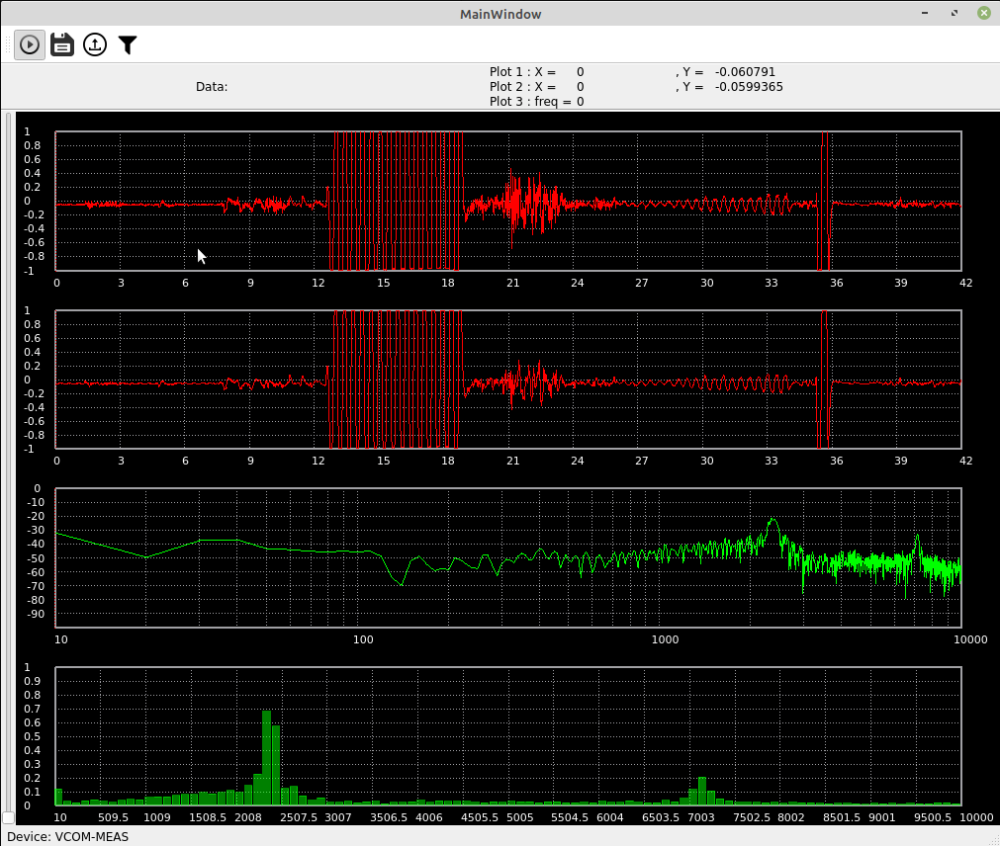
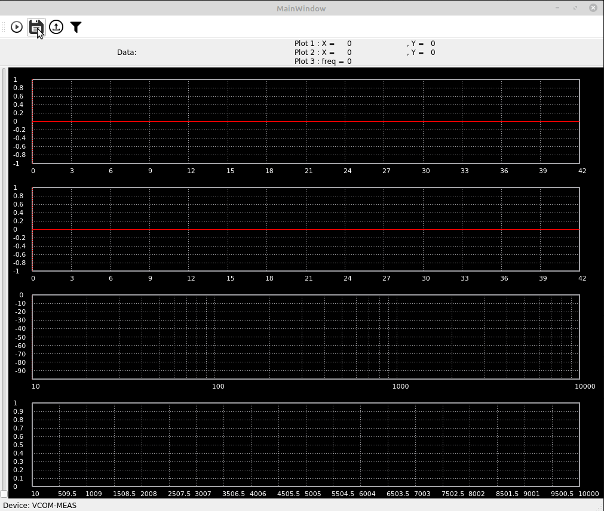
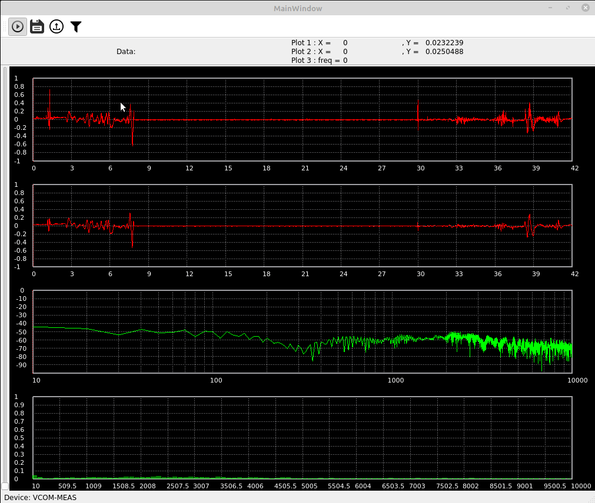
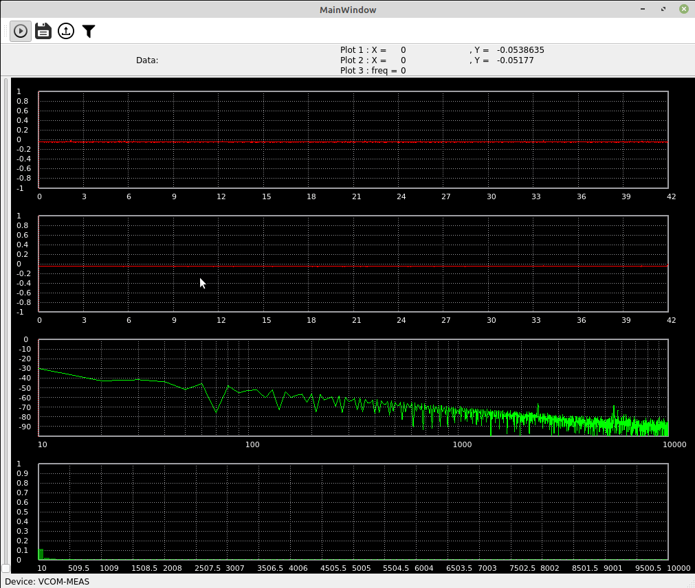

# MeansView
Aplikacja do przetwarzania odczytanego sygnału.
* C++/Qt
* [Sterownik](https://github.com/Corel-Cormen/ODP_MeansViewUSB)

# Działanie
 </a>

# Zapis/odczyt pliku
 </a>

# Filtrowanie danych
 </a>

# Opcje wyświetlania
 </a>
